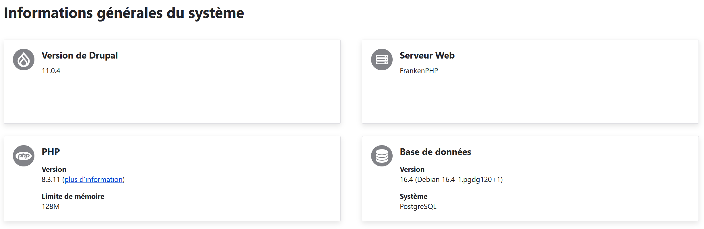

Drupal 11 with FrankenPHP
-------------------------

Drupal 11 with FrankenPHP dockerized example, with cron running using supervisord.

# With Traefik

Make sure to use a global docker network "traefik_net" on the Traefik container as well.

# Without Traefik

Remove the ":80" in the docker/frankenphp/caddy/dev/Caddyfile to allow for automatic SSL certificate generation.
Caddy (inside FrankenPHP) will automatically take care of it.

# Report status page

